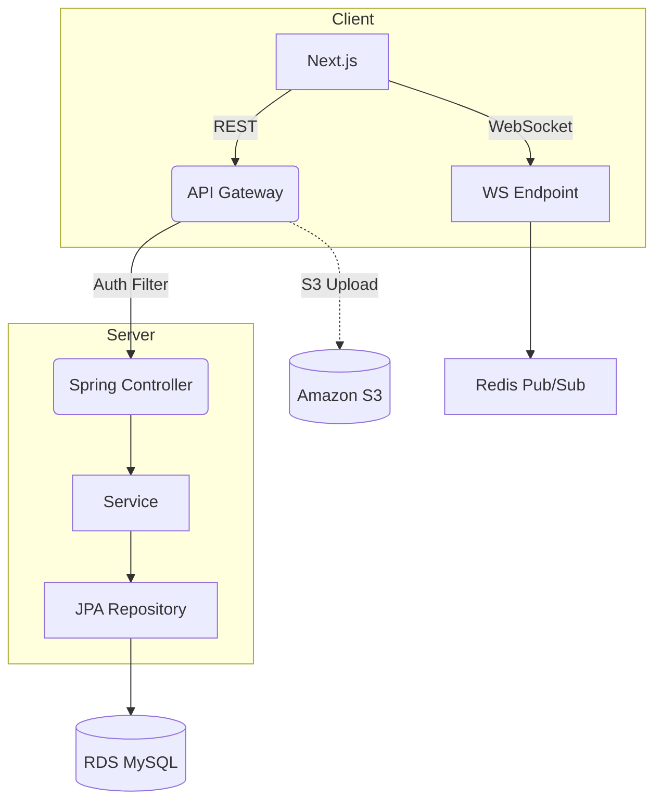

# HaksaMate

> **All-in-one 학사 생활 플랫폼** – 학사 일정, 커뮤니티, AI 튜터, 중고 마켓, 실시간 채팅까지 한 곳에서.

[](https://github.com/imhypeboy/HaksaMate_JH/actions)
[](LICENSE)
[](#%EF%B8%8F-기술-스택)

---

## ✨ 한눈에 보기

> **HaksaMate** 는 대학생을 위한 통합 학사 서비스입니다. 캘린더, AI 학습 도우미, 커뮤니티, 중고 거래, 실시간 위치 기반 매칭 등 **10여 개의 모듈**을 단일 플랫폼에 녹였습니다.  
> **Next.js 13**(App Router)와 **Spring Boot 3** 를 기반으로 구성하여 MPA 수준의 SEO와 SPA 수준의 UX를 동시에 달성했습니다.

배포 주소 : <https://haksamate.app> (예시)  
데모 영상 : `docs/demo.mp4`

---

## 🗂️ 목차

1. [주요 기능](#-주요-기능)
2. [기술 스택](#️-기술-스택)
3. [아키텍처](#-아키텍처)
4. [빠른 시작](#-빠른-시작)
5. [환경 변수](#-환경-변수)
6. [디렉터리 구조](#-디렉터리-구조)
7. [주요 명령어](#-주요-명령어)
8. [API 문서](#-api-문서)
9. [DB/스키마](#-db스키마)
10. [배포](#-배포)
11. [기여](#-기여)
12. [라이선스](#-라이선스)
13. [연락처](#-연락처)

---

## 🚀 주요 기능

- **학사 일정 캘린더**: 학사일정 · 개인 일정 통합, 공휴일 자동 반영, 통계 모달 제공
- **AI 튜터**: GPT-4o 기반 Q&A, 강의 요약, 실습 코드 리뷰 기능
- **커뮤니티 & 댓글**: 게시글/댓글 실시간 반영, `React Query` 캐싱, 알림 패널
- **중고 마켓**: 물품 등록 · 가격 제안 · 거래 내역 관리, S3 이미지 업로드
- **실시간 채팅**: STOMP WebSocket + Redis Pub/Sub, 블라인드/신고 기능
- **위치 기반 매칭**: Kakao Map SDK, Haversine 거리 계산으로 근처 사용자 매칭
- **다크모드 & 반응형**: TailwindCSS + 변수 기반 테마, 모바일 FAB

---

## ⚙️ 기술 스택

| Layer | Tech | 비고 |
| ----- | ---- | ---- |
| Frontend | Next.js 13, React 18, TypeScript, TailwindCSS, Zustand | CSR & SSR 혼합 렌더링 |
| Backend | Spring Boot 3, Spring Security, JPA(Hibernate), MySQL | REST + WebSocket API |
| Infra | AWS EC2, RDS, S3, CloudFront, Vercel | IaC: Terraform |
| DevOps | GitHub Actions, Docker, Docker Compose | CI/CD, 자동 테스트 |
| 기타 | Supabase Auth, Kakao Map SDK, ESLint/Prettier | |

---

## 🏗️ 아키텍처



---

## ⚡ 빠른 시작

### 전제 조건

- **Java 17+**  
- **Node.js 18+ / pnpm 8+**  
- **MySQL 8.x** (로컬 또는 Docker)

### 클론 & 실행

```bash
# 1) 레포지토리 클론
$ git clone https://github.com/imhypeboy/HaksaMate_JH.git
$ cd HaksaMate_JH

# 2) 백엔드 실행
$ ./gradlew bootRun  # Windows는 gradlew.bat

# 3) 프런트엔드 실행
$ cd frontend
$ pnpm install
$ pnpm dev
```

> **Tip**: 로컬 MySQL 대신 `docker compose up -d db` 로 간편 실행 가능.

---

## 🔑 환경 변수

`.env.example` 파일을 참고해 실제 값을 채워주세요.

```env
# Common
NODE_ENV=development

# Backend
SPRING_DATASOURCE_URL=jdbc:mysql://localhost:3306/haksamate
SPRING_DATASOURCE_USERNAME=root
SPRING_DATASOURCE_PASSWORD=
JWT_SECRET=changeme

# Frontend
NEXT_PUBLIC_SUPABASE_URL=
NEXT_PUBLIC_SUPABASE_ANON_KEY=
NEXT_PUBLIC_KAKAO_KEY=
```

---

## 🗃️ 디렉터리 구조

```text
HaksaMate_JH/
├─ frontend/
│  ├─ src/app/...
│  └─ public/
└─ src/main/java/com/mega/haksamate/
    ├─ controller/
    ├─ service/
    ├─ entity/
    └─ repository/
```

---

## 🛠️ 주요 명령어

| 영역 | 명령 | 설명 |
| ---- | ---- | ---- |
| FE | `pnpm dev` | 개발 서버 (http://localhost:3000) |
| FE | `pnpm build` | 프로덕션 빌드 |
| FE | `pnpm lint` | ESLint + Prettier 확인 |
| BE | `./gradlew test` | 단위/통합 테스트 |
| BE | `./gradlew jibDockerBuild` | Docker 이미지 빌드 |
| 공통 | `docker compose up -d` | MySQL/Redis 등 의존 서비스 실행 |

---

## 📚 API 문서

백엔드 구동 후 다음 경로에서 Swagger UI 확인 가능합니다.

```
http://localhost:8080/swagger-ui/index.html
```

Postman 컬렉션: `docs/HaksaMate.postman_collection.json`

---

## 🗄️ DB/스키마

ERD 다이어그램은 `docs/erd.png` 참고. Flyway 기반 마이그레이션을 사용합니다.

```bash
./gradlew flywayInfo   # 상태 확인
./gradlew flywayMigrate
```

---

## 🚢 배포

1. **Frontend**: Vercel – `main` 브랜치 푸시 → 자동 배포  
2. **Backend**: GitHub Actions → Docker Build → AWS ECR → ECS Fargate  
3. **Infra**: Terraform + SSM Parameter Store로 환경 변수 관리

자세한 워크플로우는 `.github/workflows/*.yml` 파일 참고.

---

## 🤝 기여

1. Issue 작성 → 브랜치(`feat/`, `fix/`, `chore/`)  
2. Conventional Commits 준수 (`feat:`, `fix:` 등)  
3. PR → 자동 CI 통과 후 리뷰  
4. 스쿼시 머지로 픽스 히스토리 유지

> 큰 기능 추가 전에는 먼저 **Discussion**에 설계 제안 부탁드립니다.

---

## 📜 라이선스

이 프로젝트는 **MIT License**를 따릅니다. LICENSE 파일을 확인하세요.

---

## 📧 연락처

| 역할 | 이름 | 연락 |
| ---- | ---- | ---- |
| Maintainer | 강종호 | <kangjh0205@gmail.com> |

